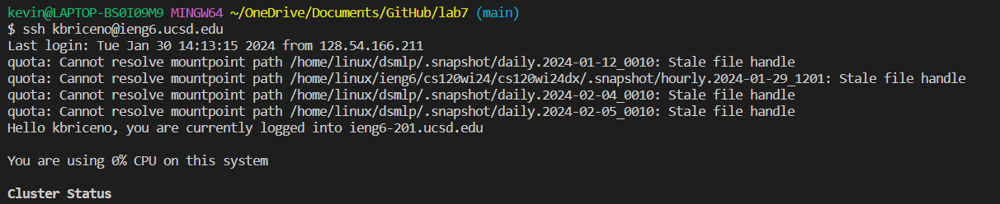
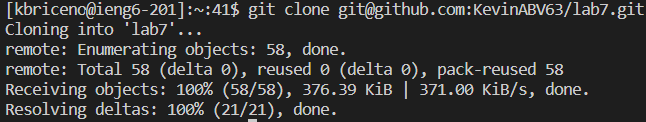
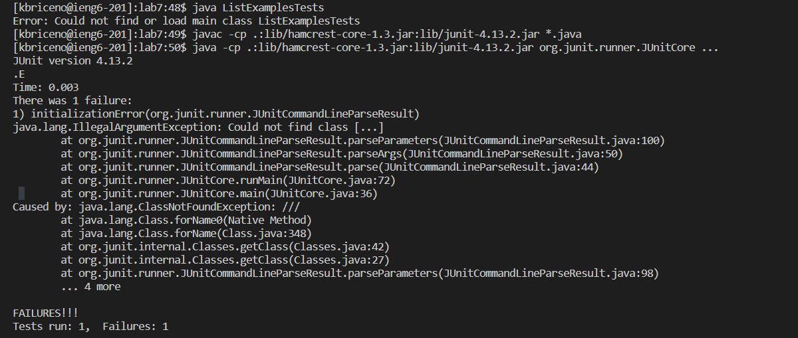
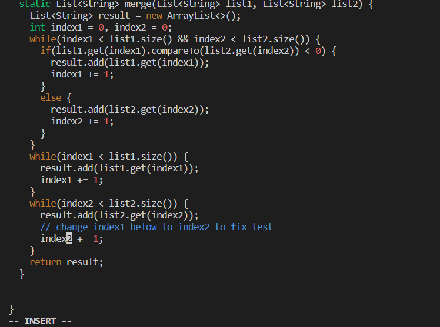
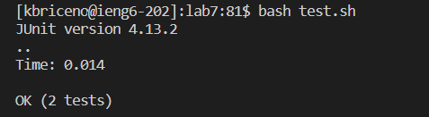
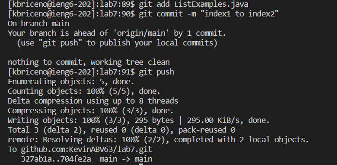

# Lab Report 4
## Step 4: Log into Ieng6.

## Step 5: Cloning forked repository

## Step 6: Running tests and failing

## Step 7: Editing the code and fixing test

## Step 8: Running the tests again and succeeding

## Step 9: Committing and pushing change to Github

