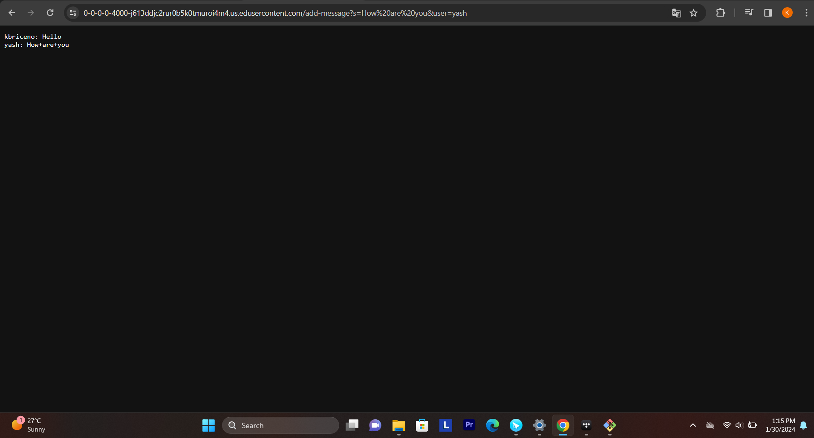

# Part 1

## ChatServer

```
{
import com.sun.net.httpserver.HttpExchange;

import java.io.IOException;
import java.net.URI;

class ChatHandler implements URLHandler {
    private StringBuilder chatMessages = new StringBuilder();

    public String handleRequest(URI url) {
        String path = url.getPath();

        if (path.startsWith("/add-message")) {
            String[] parameters = url.getQuery().split("&");

            String user = null;
            String message = null;

            for (String parameter : parameters) {
                String[] keyValue = parameter.split("=");
                if (keyValue.length == 2) {
                    if (keyValue[0].equals("user")) {
                        user = keyValue[1];
                    } else if (keyValue[0].equals("s")) {
                        message = keyValue[1];
                    }
                }
            }

            if (user != null && message != null) {
                String newMessage = user + ": " + message + "\n";
                chatMessages.append(newMessage);
                return chatMessages.toString();
            }
        }

        return "Invalid request";
    }
}

public class ChatServer {
    public static void main(String[] args) throws IOException {
        if (args.length == 0) {
            System.out.println("Missing port number! Try any number between 1024 to 49151");
            return;
        }

        int port = Integer.parseInt(args[0]);

        Server.start(port, new ChatHandler());
    }
}

} 
```


### Scenario 1: After /add-message?s=Hello&user=kbriceno
#### Methods Called:

`handle` method in `ChatHandler` class is called.

#### Relevant Arguments and Values:

URL: /add-message?s=Hello&user=kbriceno

##### Parameters Extracted:

user: "kbriceno"

message: "Hello"

#### Changes in Relevant Fields:

`chatMessages` field in `ChatHandler` class:

Before: Empty StringBuilder

After: Appended with "kbriceno: Hello\n"



### Scenario 2: After /add-message?s=How%20are%20you&user=yash
#### Methods Called:

`handle` method in `ChatHandler` class is called.

#### Relevant Arguments and Values:

URL: /add-message?s=How%20are%20you&user=yash

##### Parameters Extracted:

user: "yash"

message: "How+are+you"

#### Changes in Relevant Fields:

`chatMessages` field in `ChatHandler` class:

Before: "kbriceno: Hello\n"

After: Appended with "yash: How%20are%20you\n"

# Part 2


